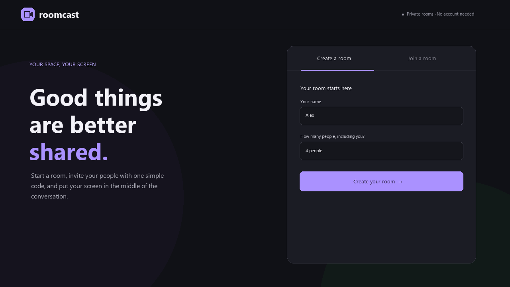
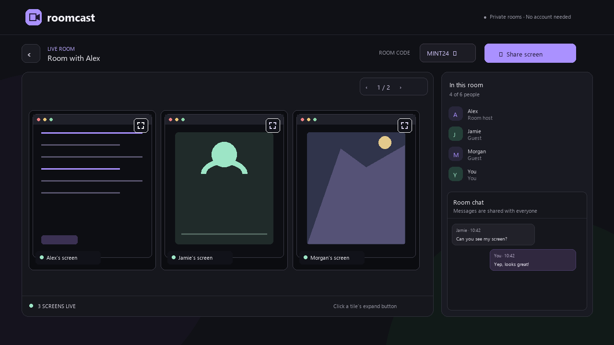
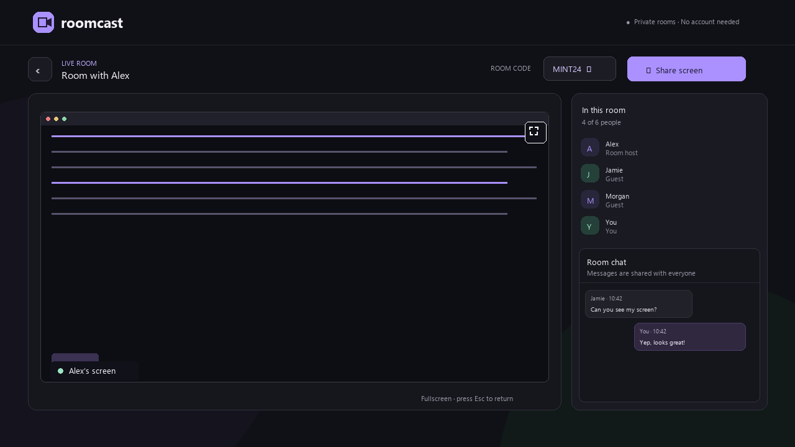

# Roomcast

Roomcast is a code-based group screen-sharing app. Create a private room, invite people with a short code, chat together, and view several shared screens at once.

## Short walkthrough

## What it does

- Create a room for **2–8 people**, including the host.
- Join with a room code and display name; no account is needed.
- Send messages in the live room chat.
- Let any participant share a screen. Up to three shares appear as tiles on each page; use **<** and **>** to browse additional shares.
- Click the expand button in a tile to maximize that person's shared screen. Press **Escape** to return to the tiled room view.

## Pictures

### Create a room

Choose your name and the room capacity, then create the room and share its code.

### Screen tiles, chat, and maximize controls

Each screen tile has its own expand button in the upper-right corner. It maximizes that participant's screen for you; it does not change what other people see.

### A maximized screen

The screen fills your browser window. Press **Escape** to go back to all the screen tiles.

## How it works

1. The Node.js server creates a random room code and records the room's participant limit.
2. Guests enter the code. The server checks that the room exists and has available spaces.
3. WebSockets carry room membership, chat messages, and the setup messages needed to connect participants.
4. WebRTC carries screen video between participants. Each share is shown in its own tile.
5. The expand button uses your browser's fullscreen feature on the selected tile. Fullscreen affects only your view.

Rooms and the latest 100 chat messages stay in server memory. They are cleared when the host leaves or the server restarts. Roomcast does not create persistent user accounts.

## Run locally

1. Install Node.js 18 or newer.
2. In this folder, run `npm install`.
3. Run `npm start`.
4. Open [http://localhost:3000](http://localhost:3000).

Screen capture is available on `localhost` and secure HTTPS sites. If hosting beyond your own computer, serve the app over HTTPS so its WebSocket connection uses WSS. Some networks need a TURN server for WebRTC; the app currently uses a public STUN server, which may not work through every firewall.

## Project files

- `server.js` — web server, room codes, chat relay, and WebRTC signaling.
- `public/` — app interface, styles, and browser-side screen sharing.
- `docs/images/` — README illustrations and animated demo.
- `docs/create_readme_media.py` — script used to regenerate the README pictures and GIF (requires Pillow).
